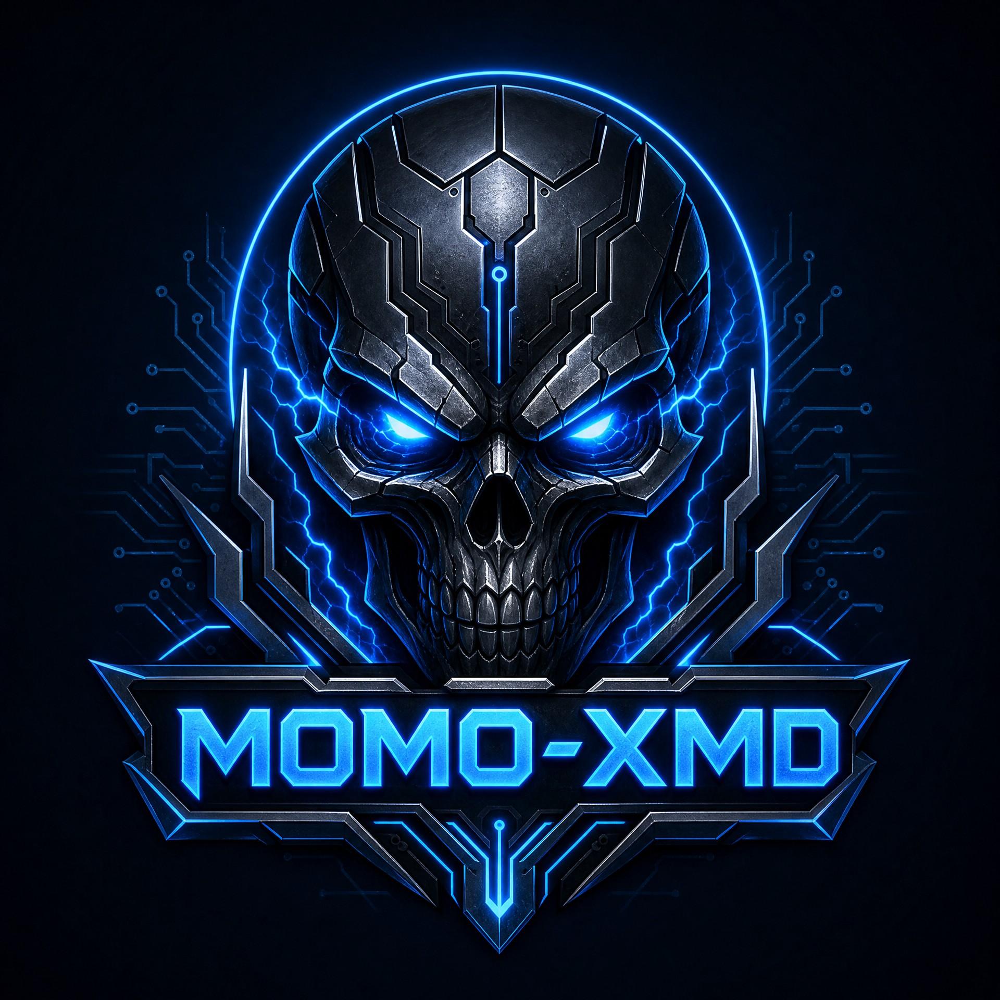

# 💀 MOMO-XMD • BLUE DARK WEB EDITION 💀

<p align="center">
  
</p>

<p align="center">
  <a href="https://github.com/MOMO47-tech/MOMO-XMD"></a>
  <a href="https://github.com/MOMO47-tech/MOMO-XMD"></a>
</p>

<p align="center">
  
</p>

---

## 🌑 WELCOME TO THE DARK SIDE

**MOMO-XMD** is a Blue Dark Web WhatsApp bot with a scary neon pairing interface, blue skull branding, background music, lightning effects, server-side pairing handoff, and public menu access.

## ⚡ FEATURES

- **Blue Scary Hacker UI** with the MOMO-XMD skull logo shown above.
- **Pairing code and QR pairing** in the same interface.
- **Four pairing server links** for alternative connection routes.
- **Server-side session handoff** after pairing; users do not receive a Session ID.
- **Background music, animated text, lightning effects, and a truthful counter of completed pairings.**
- **Public `.menu` command** that responds to normal users as well as the owner.
- **View-once controls:** owner can enable `.autoviewonce on` for automatic reveal, use `.vv` on a quoted view-once image to resend it in the current chat, or use `.vv2` to send it to the connected account inbox.

---

## 🔗 PAIRING SERVERS

<p align="center">
  <a href="https://momo-xmd-pairing-4086f8388df8.herokuapp.com/"></a>
  <a href="https://momo-xmd-pairing2-fd35d1ed19df.herokuapp.com/"></a>
  <a href="https://momo-xmd-pairing.onrender.com/"></a>
  <a href="https://momo-xmd-pairing.duckdns.org/"></a>
</p>

---

<p align="center">
  <a href="https://github.com/MOMO47-tech/MOMO-XMD/fork"></a>
  <a href="https://github.com/MOMO47-tech/MOMO-XMD/archive/refs/heads/main.zip"></a>
</p>

> Deployment is managed by the MOMO-XMD owner. Users should open a pairing link above; no Heroku or Render deployment action is required.

---

## 📢 CHANNELS

<p align="center">
  <a href="https://whatsapp.com/channel/0029Vb8AYLf2f3EA8Y4qp63H"></a>
  <a href="https://whatsapp.com/channel/0029VbDNET6KmCPShs9dyg1U"></a>
</p>

## ☎️ OWNER CONTACT

<p align="center">
  <a href="https://wa.me/255760298574"></a>
  <a href="https://wa.me/255765409584"></a>
</p>

---

## 💀 PAIRING INSTRUCTIONS

1. Open one of the four pairing servers above. Do not use the DuckDNS link until its DNS target is active.
2. Enter your WhatsApp number with the country code.
3. Choose pairing code or QR pairing.
4. For pairing code, open **WhatsApp → Linked Devices → Link a Device → Link with phone number instead**.
5. Enter the displayed code and wait for the decorated **CONNECTED** confirmation. The pairing handoff and auth data remain server-side; nothing needs to be copied into a deployment form.

## Status automation

Owner anaweza kutumia `.autoviewstatus on` ku-mark status za contacts kama viewed mara moja baada ya kupokelewa, ikiwemo status zinazotumwa na contacts wanaoonekana kupitia groups. Tumia `.autoviewstatus off` kuizima. Kupenda status ni setting tofauti: `.autolikestatus on` huongeza reaction ya like, na haihitajiki ili viewing ifanye kazi.

Emoji ya status like huchaguliwa na owner kwa command hii:

```text
.setstatus emoj 💚
.setstatus emoj ❤️
.setstatus emoj 🔥
.setstatus emoj 💔
.setstatus emoj ❤️‍🩹
.setstatus emoj ✅
```

Emoji moja tu kati ya hizo inaruhusiwa, na setting yake huhifadhiwa kwenye runtime. `.setstatusemoj <emoji>` bado inafanya kazi kama alias. Ikiwa `.autolikestatus on` imewashwa, emoji iliyochaguliwa ndiyo itatumika kwenye status likes.

`.autoreact on` hu-react kwa ujumbe mpya unaoingia kwenye inbox na groups; `.autoreact off` huizima. Autoreact hutumia ❤️ na haireact messages zinazotumwa na bot yenyewe.

## Security and presence automation

Owner anaweza kuwasha ulinzi wa defensive dhidi ya media/files zenye viashiria vya payload hatari, extension hatari, control-character flood au document isiyoaminika:

```text
.antibug on
.antibug off
```

Ikiwa imewashwa, bot hujaribu **ku-delete ujumbe**, **kumblock mtumaji** na kuweka tukio kwenye log mara moja. Ikiwa Baileys build inayotumika ina `reportMessage`, bot hujaribu report moja ya spam kwa ujumbe huo; WhatsApp ndiyo huamua hatua yoyote zaidi, hivyo bot haiwezi kuahidi au kulazimisha kufungiwa account ya mtu.

```text
.autorecording on
.autorecording off
```

```text
.autotyping on
.autotyping off
```

`autorecording` huonyesha presence ya recording kwenye inbox na groups zinazojulikana, huku `autotyping` ikiweka presence ya typing/composing. Presence husasishwa kwa heartbeat fupi wakati setting iko on na huwekwa paused baada ya zote kuzimwa. Features hizi hazitumii Session ID wala background service tofauti.

## Block management

Owner anaweza kuangalia idadi na orodha ya users walioblock kwa:

```text
.blacklist
```

Kumblock user kwa namba:

```text
.block +255784972778
```

Au reply ujumbe wa user unayetaka kumblock kisha andika:

```text
.block
```

Ku-unblock tumia namba au reply hiyo hiyo:

```text
.unblock +255784972778
```

Ukiwa kwenye inbox ya user aliyeblockiwa, reply ya `.unblock` humtarget huyo user moja kwa moja. Orodha huhifadhiwa kwenye runtime ya connected account na response zote zinaonyesha success au error kwa bold, tiki ya kijani na footer ya MOMO47.

Baada ya **CONNECTED**, Termux runtime huendelea na channel follows nne na group join kwa background; kazi hizo hazipaswi kuchelewesha command handling.

---

<p align="center">
  <strong>DESIGNED BY MOMO47 • MOMO-XMD • 2026</strong>
</p>

> The pairing service uses server-side auth handoff and does not deliver Session IDs to users.
> The first two links are Heroku pairing services, the third is the Render pairing service, and the fourth is the DuckDNS hostname. The DuckDNS hostname becomes active only after its DNS record is pointed to a running pairing service.

References:
- [MOMO-XMD repository](https://github.com/MOMO47-tech/MOMO-XMD)
